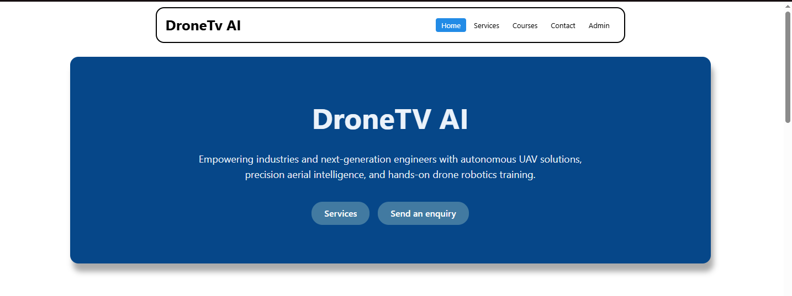
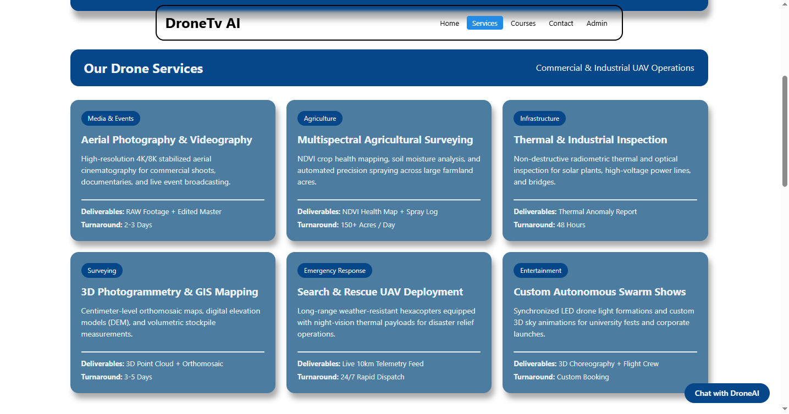
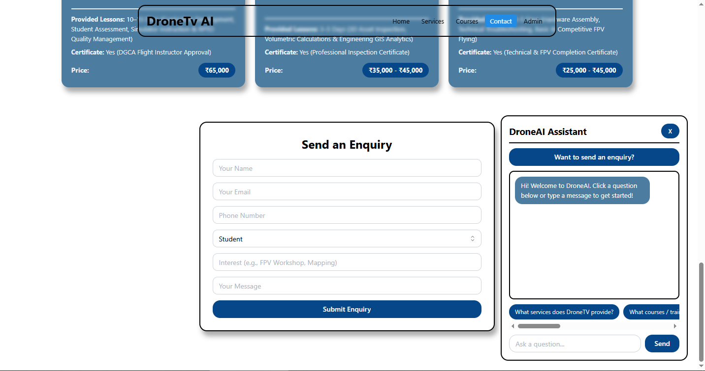
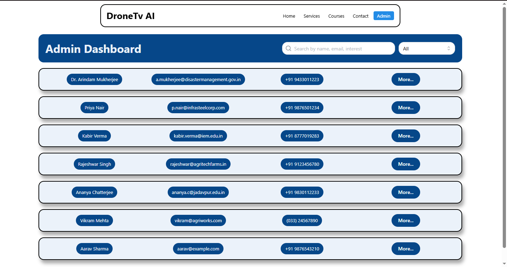

# DroneTV AI — Autonomous UAV Solutions & Training Platform

A full-stack, mobile-responsive web application built for **DroneTV AI** (`dronetv.in`). The platform showcases commercial UAV services, DGCA-certified pilot and specialization training courses, an interactive FAQ Chatbot Assistant, a customer/student enquiry system, and a real-time Admin Dashboard for managing enquiries.

---

## Features

### 1. Home Page & Navigation

- **Sticky Smart Header:** Smooth-scroll section navigation (`Home`, `Services`, `Courses`, `Contact`) with automatic scroll-spy active tab highlighting and instant routing to the `Admin` view.
- **Landing Section:** Hero banner introducing DroneTV AI with quick-action CTA buttons (`Services` and `Send an enquiry`).
- **Drone Services Grid:** Responsive card layout displaying commercial UAV services, categories, deliverables, and turnaround times.
- **Training & Courses Grid:** Detailed course cards displaying official DroneTV / India Drone Academy certification levels, course names, descriptions, lesson durations, certification details, and pricing.
- **Responsive Design:** Fluid layouts built with CSS Grid (`auto-fit` / `minmax`), Flexbox wrapping, and `clamp()` typography that adapt seamlessly across Mobile (375px), Tablet / iPad Mini (768px), and Desktop (1440px).

### 2. Interactive DroneAI Chatbot

- **Floating Assistant:** Expandable/collapsible floating chat window on the Home page.
- **Predefined FAQ Pills:** Horizontal scrollable quick-question pills supporting all core DroneTV queries (`What services does DroneTV provide?`, `What courses / training are available?`, `How can I contact DroneTV?`, `How can I register?`, `I am interested in a service.`, `I am a student.`, `I want to speak with someone.`).
- **Keyword Matching & Auto-Scroll:** Responds to typed user queries and automatically scrolls to the latest message.
- **Direct Enquiry Jump:** Includes a _"Want to send an enquiry?"_ button that smoothly scrolls users directly to the Enquiry Form.

### 3. Enquiry Form & Admin Dashboard

- **Enquiry Submission:** Validates and submits user enquiries (`Name`, `Email`, `Phone`, `User Type`, `Interest`, `Message`) with instant feedback and React Query cache invalidation.
- **Real-Time Search & Filtering:** Filter enquiries by user type (`All`, `Student`, `Customer`, `Other`) and search dynamically across `name`, `email`, and `interest`.
- **Detailed Enquiry Modal:** View complete enquiry details, decode sanitized HTML entities safely, update enquiry status (`New`, `Contacted`, `In Progress`, `Closed`), or delete enquiries permanently.
- **Empty State Handling:** Displays `"No enquiries available"` when the database is empty or no records match the active search filter.

---

## Technologies Used

### Frontend (`client/`)

- **React 19** (with **TypeScript** & **Vite**)
- **Mantine UI** (`@mantine/core`, `@mantine/hooks`) — `Button`, `Input`, `Select`, `Tabs`, `Modal`
- **TanStack React Query** (`@tanstack/react-query`) — Asynchronous server state management, caching, and mutations
- **Axios** — HTTP client for REST API communication
- **React Router DOM** (`react-router-dom`) — Client-side routing (`/` and `/admin`)
- **Lucide React** (`lucide-react`) — UI icons

### Backend (`server/`)

- **Node.js** & **Express.js** — REST API server
- **MongoDB** & **Mongoose** — NoSQL database, schema validation, and indexing
- **Validator** / Custom Sanitization — Input validation and XSS protection
- **CORS** & **Dotenv** — Cross-origin resource sharing and environment configuration

---

## Project Structure

```text
dronetv-ai/
├── client/                          # React + TypeScript Frontend (Vite)
│   ├── src/
│   │   ├── components/
│   │   │   ├── chatbox.tsx          # Floating FAQ Chatbot Assistant
│   │   │   ├── enquiryDetails.tsx   # Admin Modal for status updates & deletion
│   │   │   ├── enquirySection.tsx   # Admin enquiry list & empty state handling
│   │   │   ├── homeEnquiryForm.tsx  # Customer/Student Enquiry Form section
│   │   │   ├── landingSection.tsx   # Hero section with CTA scroll buttons
│   │   │   ├── searchAndFilter.tsx  # Search bar & User Type filter dropdown
│   │   │   ├── serviceSection.tsx   # Commercial Drone Services grid
│   │   │   ├── stickyHeader.tsx     # Sticky navigation header with scroll-spy
│   │   │   └── trainingSection.tsx  # DroneTV Training & Courses grid
│   │   ├── pages/
│   │   │   ├── admin.tsx            # Admin Dashboard page (/admin)
│   │   │   └── home.tsx             # Main Home page (/)
│   │   ├── App.tsx                  # Root layout & Route definitions
│   │   └── main.tsx                 # React DOM, MantineProvider & QueryClientProvider
│   ├── package.json
│   ├── tsconfig.app.json
│   ├── tsconfig.node.json
│   └── vite.config.ts
│
├── server/                          # Node.js + Express Backend
│   ├── config/                      # MongoDB connection setup
│   ├── controller/
│   │   └── enquiryController.js     # CRUD controllers for enquiries
│   ├── models/
│   │   └── enquiryModel.js          # Mongoose Enquiry schema & indexes
│   ├── routes/
│   │   └── enquiryRoutes.js         # Express router for /api/enquiries
│   ├── .env                         # Environment variables (ignored in Git)
│   ├── index.js / server.js         # Express app entry point
│   └── package.json
│
└── README.md                        # Project Documentation
```

---

## Setup Instructions

### Prerequisites

- **Node.js** (v18+ recommended)
- **npm** (v9+ recommended)
- **MongoDB** (Local MongoDB Community Server or MongoDB Atlas cluster)

### 1. Clone the Repository

```bash
git clone [https://github.com/](https://github.com/)<your-github-username>/<your-repo-name>.git
cd <your-repo-name>
```

### 2. Install Backend Dependencies

```bash
cd server
npm install
```

### 3. Install Frontend Dependencies

```bash
cd ../client
npm install
```

---

## Environment Variables

Create a `.env` file inside the **`server/`** directory with the following variables:

```env
PORT=3011
MONGO_URI=mongodb://127.0.0.1:27017/dronetv_enquiries
```

_(If using **MongoDB Atlas**, replace `MONGO_URI` with your Atlas connection string: `mongodb+srv://<username>:<password>@cluster0.mongodb.net/dronetv_enquiries`)_

---

## Database Setup

1. **Local MongoDB:** Ensure your local MongoDB service (`mongod`) is running on port `27017`. Mongoose will automatically create the `dronetv_enquiries` database and `enquiries` collection upon the first submission.
2. **MongoDB Atlas (Cloud):** Create a free cluster on [MongoDB Atlas](https://www.mongodb.com/cloud/atlas), whitelist your IP (`0.0.0.0/0` for development), and paste the connection string into `server/.env` as `MONGO_URI`.

---

## Run Instructions (Backend & Frontend)

### 1. Start the Backend Server

Open a terminal in the `server/` directory:

```bash
cd server
npm run dev
# Or: node index.js / npm start
```

The backend API will start at **`http://localhost:3011`**.

### 2. Start the Frontend Application

Open a second terminal in the `client/` directory:

```bash
cd client
npm run dev
```

The React application will start at **`http://localhost:5173`**.

### 3. Build Frontend for Production (Optional)

```bash
cd client
npm run build
```

---

## API Endpoints

**Base URL:** `http://localhost:3011/api/enquiries`

| Method   | Endpoint             | Description                                           | Request Body / Params                                             |
| :------- | :------------------- | :---------------------------------------------------- | :---------------------------------------------------------------- |
| `POST`   | `/api/enquiries/`    | Create a new enquiry                                  | `{ "name", "email", "phone", "userType", "interest", "message" }` |
| `GET`    | `/api/enquiries/`    | Fetch all enquiries (supports optional query filters) | Optional query params: `?userType=Student&status=New`             |
| `GET`    | `/api/enquiries/:id` | Fetch a single enquiry by ID                          | URL Param: `id` (MongoDB ObjectId)                                |
| `PUT`    | `/api/enquiries/:id` | Update enquiry status or details                      | `{ "status": "New" \| "Contacted" \| "In Progress" \| "Closed" }` |
| `DELETE` | `/api/enquiries/:id` | Delete an enquiry by ID                               | URL Param: `id` (MongoDB ObjectId)                                |

### Sample `POST /api/enquiries/` Payload

```json
{
  "name": "Debasish Maity",
  "email": "debasish@example.com",
  "phone": "+91 9876543210",
  "userType": "Student",
  "interest": "DGCA Remote Pilot Certificate",
  "message": "I would like to know the next batch schedule."
}
```

---

## Screenshots

> _(Add your screenshots inside a `screenshots/` folder in the root directory or upload them directly to your GitHub README)_

- **Home Page & Landing Section (Desktop):**
  
- **Services & Training Courses Grid:**
  
- **Interactive Chatbot & Enquiry Form:**
  
- **Admin Dashboard & Enquiry Detail Modal (Desktop, Tablet & Mobile):**
  
